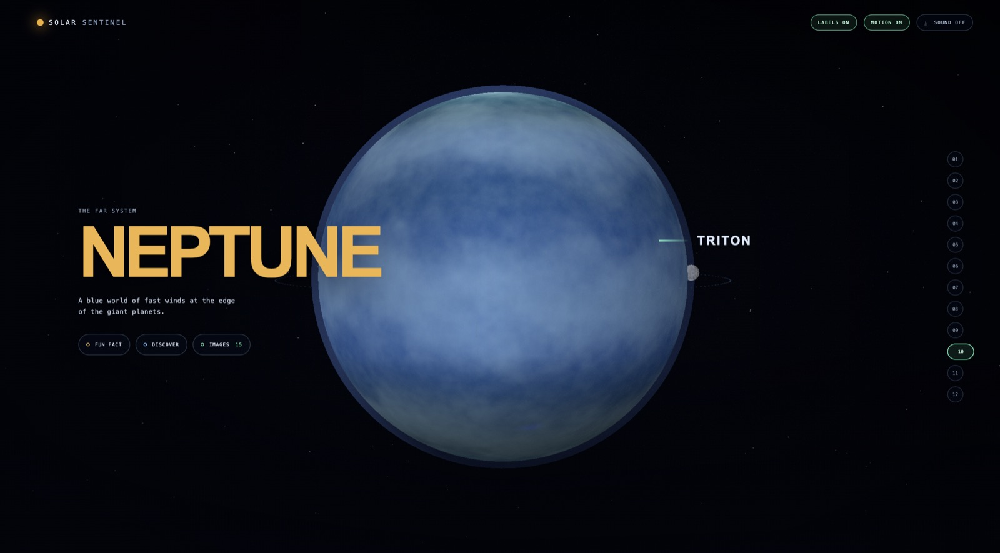
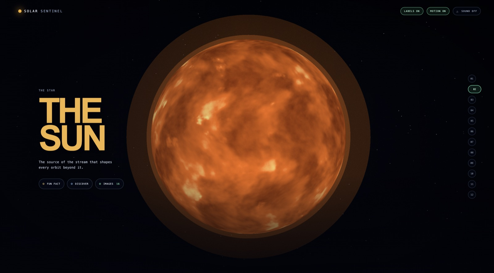
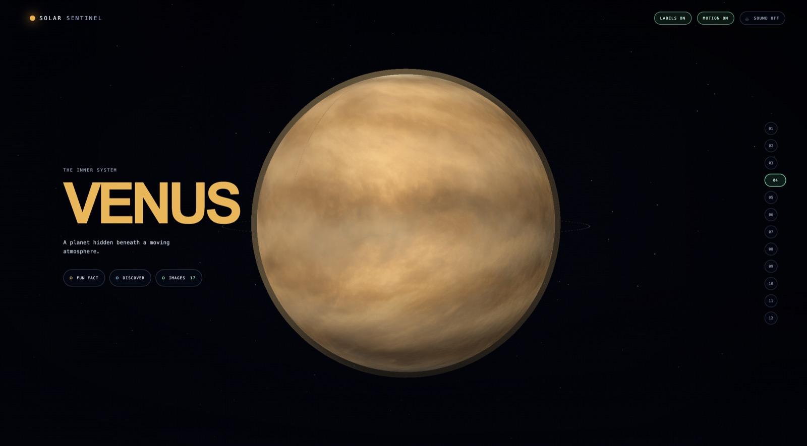
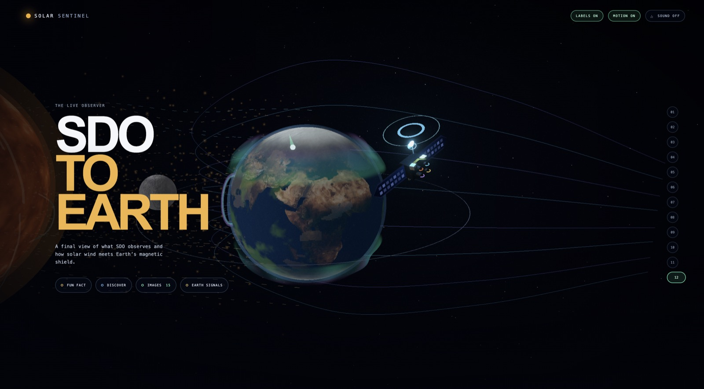

# Solar Sentinel

**A cinematic, source-linked atlas of the Solar System culminating in a live Sun-to-Earth space-weather story.**

Solar Sentinel turns publicly available space-agency science into a visual journey. Learners begin with the Solar System, move through each world in a scroll-snapped chapter, open short source-backed discoveries and image galleries, then finish at Earth to see how solar observations connect to Earth's magnetic environment.

It is built for the **Education** category of OpenAI Build Week. The final Solar Sentinel chapter uses GPT as a grounded explainer not a prediction engine.

> Visuals are illustrative and not to scale. The product distinguishes observations, official forecasts, and educational scenarios rather than presenting simulation as operational advice.

## Experience preview

| Neptune | The Sun |
| --- | --- |
|  |  |
| **Outer-system chapter** a close view, moon labels, and short discovery actions. | **Star chapter** a dramatic Sun surface with on-demand facts, source links, and images. |

| Venus | SDO to Earth |
| --- | --- |
|  |  |
| **Planetary chapters** sparse persistent copy; detail is revealed only when asked for. | **Solar Sentinel finale** solar activity, an illustrative magnetic shield, and live source context. |

## What the experience does

1. **System map** a wide, explorable Solar System, using current NASA/JPL Horizons vectors for the planets and Moon. Bodies can lead directly to their dedicated chapters.
2. **Twelve cinematic chapters** the system, Sun, Mercury, Venus, Earth, Mars, Jupiter, Saturn, Uranus, Neptune, Pluto, and a final **SDO to Earth** chapter.
3. **A consistent learning rhythm** every chapter offers **Fun fact**, **Discover**, and **Images**. Hover previews a compact glass card; click pins it. Opening another action replaces the previous card, so the scene stays clear.
4. **Source-linked planetary context** each destination contains concise science content and a curated gallery with links back to the responsible source. NASA, ESA, JAXA, ISRO, and other agency references are shown as provenance where used; only explicitly marked feeds are live.
5. **Earth, spatially grounded** a geographic Earth surface, Moon, city search and beacon, atmospheric glow, and magnetic shield help make the Sun–Earth relationship legible without claiming local aurora or outage predictions.
6. **Live space-weather context** NASA SDO visuals, NOAA SWPC readings and official forecast context, plus a NASA DONKI May 2024 replay give the finale both a live and a reliable historical path.
7. **Grounded AI explanation** Ask Solar Sentinel produces a compact briefing separated into **Observed**, **Official forecast**, **Scenario**, and **Uncertainty**, with source notes attached by the application.

## Interaction design

- **Scroll or chapter rail** to move deliberately between scenes; chapters snap into place.
- **Labels** can be toggled on or off for a quiet viewing mode.
- **Motion** can be disabled for a reduced-motion experience.
- **Sound** controls the looping Smooth Meditation ambient bed. It starts enabled where the browser permits autoplay; a manual tap always enables it when autoplay is blocked.
- The final Earth Signals instrument remains on demand, so the cinematic SDO-to-Earth scene is never covered by a permanent dashboard.

## Scientific integrity

Solar Sentinel keeps three distinct truth layers visible:

| Layer | Meaning | How Solar Sentinel uses it |
| --- | --- | --- |
| `LIVE OBSERVED` | NASA/NOAA measurements and latest available imagery | Drives live status and Earth Signals context |
| `NOAA FORECAST` | NOAA's official outlook | Presented separately from observations |
| `SOLAR SENTINEL SCENARIO` | An educational visual response | Changes the illustration only; never presented as a prediction |

The experience avoids claims about local outages, guaranteed aurora visibility, exact GPS accuracy, or storm-arrival times.

## Data, missions, and provenance

| Source | Purpose |
| --- | --- |
| [NASA SDO](https://sdo.gsfc.nasa.gov/mission/) | Latest available solar imagery and Sun context |
| [NASA/JPL Horizons](https://ssd.jpl.nasa.gov/horizons/) | Current heliocentric planet vectors and Earth-relative Moon vector |
| [NASA Image and Video Library](https://images.nasa.gov/) | Source-linked planetary and lunar imagery |
| [NOAA SWPC](https://www.swpc.noaa.gov/products-and-data) | Kp, solar-wind speed, IMF Bz, official Kp forecast, alerts, and OVATION aurora model |
| [NASA CCMC DONKI](https://ccmc.gsfc.nasa.gov/tools/DONKI/) | Historical May 2024 geomagnetic-storm replay |
| [NASA Blue Marble](https://science.nasa.gov/earth/earth-observatory/the-blue-marble-true-color-global-imagery-at-1km-resolution/) | Geographic Earth surface texture |
| [Open-Meteo Geocoding](https://open-meteo.com/en/docs/geocoding-api) | Global city-coordinate lookup |

Detailed data rules, source links, refresh behaviour, and limitations live in the [data register](docs/solar-sentinel-data-sources.md). Asset attribution is recorded in [ASSET_CREDITS.md](docs/ASSET_CREDITS.md).

## Architecture

```text
NASA SDO ──► /api/solar-image ─┐
NASA/JPL ──► /api/solar-system ┼──► source-linked Three.js / React Three Fiber scenes
NOAA SWPC ─► /api/snapshot ───┼──► validated space-weather snapshot + Earth Signals
NASA DONKI ► /api/replay ─────┘
                                   │
Selected city ► geocoding ► geographic Earth + city beacon
                                   │
Verified source context ─► /api/explain ─► structured GPT explanation
```

- **Next.js + React + TypeScript** for the application and server-side source adapters.
- **Three.js / React Three Fiber** for the scroll-directed planetary scenes, lighting, textures, and illustrative magnetic-environment effects.
- **Zod** validates data at server boundaries and constrains the explainer response.
- **OpenAI Responses API** generates the optional briefing; the app itself attaches validated sources and timestamps instead of letting the model invent citations.

## Run locally

```bash
npm install
cp .env.example .env.local
npm run dev
```

Open <http://localhost:3000>.

Live source routes work without an OpenAI key. Add a server-only key to enable GPT briefings:

```bash
# .env.local — never use NEXT_PUBLIC_ for this value
OPENAI_API_KEY=your_key_here
OPENAI_EXPLAINER_MODEL=gpt-5.6-sol
```

Without a key, the explainer retains a source-grounded, explicitly labelled deterministic guide.

## Verify

```bash
npm test
npm run build
```

The suite covers the NOAA, DONKI, and Horizons adapters; explanation truth layers; geographic city presentation; scenarios; geocoding; textures; and request-rate limiting.

## Deploy responsibly

1. Import the repository into a deployment provider such as Vercel.
2. Set `OPENAI_API_KEY` (and optionally `OPENAI_EXPLAINER_MODEL`) as **server** environment variables.
3. Verify snapshot freshness states, solar imagery, city search, reduced motion, replay, and the explainer.
4. Do not commit environment files: `.env`, `.env.*`, private-key formats, and local caches are ignored by default. `.env.example` is intentionally the only tracked template.

For multi-instance production, replace the in-memory last-good snapshot cache and request limiter with shared infrastructure. The current implementation is intentionally sized for a hackathon demo.

## Hackathon materials

- [Demo narration and screen plan](docs/DEMO_SCRIPT.md)
- [Codex contribution log](docs/CODEX_WORKLOG.md)
- [Product and implementation decisions](docs/DECISIONS.md)

## Limitations

- Solar Sentinel is a science-learning experience, not an operational alerting tool.
- Aurora response uses NOAA's global OVATION model output; it does not calculate visibility for a specific street, city, or observer.
- Earth is a geographic orientation texture, not a live Earth-imagery product.
- System-map positions use current JPL vectors; body sizes, orbit guides, moon arrangements, time acceleration, particle paths, SDO orbit, aurora curtains, shield compression, and scenarios are visual explanations—not a to-scale physical simulator.
- Agency references in galleries and provenance are contextual unless a layer is explicitly labelled live.
